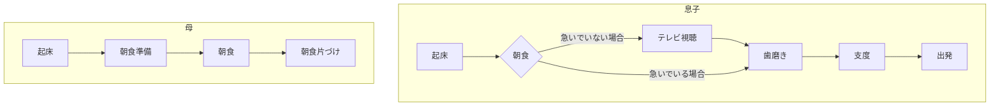

# Writerside所感

Writersideを使ってみました。

## VSCodeとの違い

- 英語のspellチェックがデフォルトで強力
- markdownの簡単なWarningなどはデフォルトで出力してくれる（例 Element has no title)
- Browserで表示のチェックなどができる
- mermaidもデフォルトで記載可能
- TODOなどもデフォルトでついている（自分は動作しなかった）
- 引用中に"{style="warning"}"とするとWarningになる
- タブ機能がついている
- ZIP化機能がついている

[mermaidのコードは以下URLから引用](https://zenn.dev/kento_mm_ninw/articles/8b10afdbef306a)

> メモ
> 引用は">"で記載可能 {style="warning"}

<tabs>
    <tab title="First tab">
        テスト
    </tab>
    <tab title="Second tab">
        テスト2
    </tab>
</tabs>

上記タブの記載方法は以下
~~~
<tabs>
    <tab title="First tab">
        テスト1
    </tab>
    <tab title="Second tab">
        テスト2
    </tab>
</tabs>
~~~

## 拡張機能

Jetbrainsの拡張機能が使用できる。以下の文書作成に使う拡張機能もついている。

- [textlint](https://plugins.jetbrains.com/plugin/22806-textlint)
- [AsciiDoc](https://plugins.jetbrains.com/plugin/7391-asciidoc)
- [Drawio](https://plugins.jetbrains.com/plugin/15635-diagrams-net-integration)

drawioで記載すると以下のイメージになる。

## 感想

デフォルトでいろんな機能が含まれているので、便利だと感じた。
拡張機能もある程度揃っていると思われるが、VSCodeと比較すると数が少ないので、痒いところに手がとどかないことが出てくるのではないかと思った。
